# stoma-selfcare-review 概要设计 2026-07-27

## 一、系统概述

肠造口居家自护 AI 复核助手面向山西白求恩医院的造口专科团队与肠造口术后患者，系统由护士预先审核并按版本维护居家自护要点，患者或主要照护者按要点提交执行记录，AI 仅做语义比对与依据整理，最终判断由造口专科护士完成。整个系统不与任何外部系统对接，所有数据保存在本机数据库，导出文件自动脱敏，可以放心用于先导试用。

## 二、访问方式

系统在浏览器中以无登录方式运行，分别提供患者端和护士管理端两个入口。

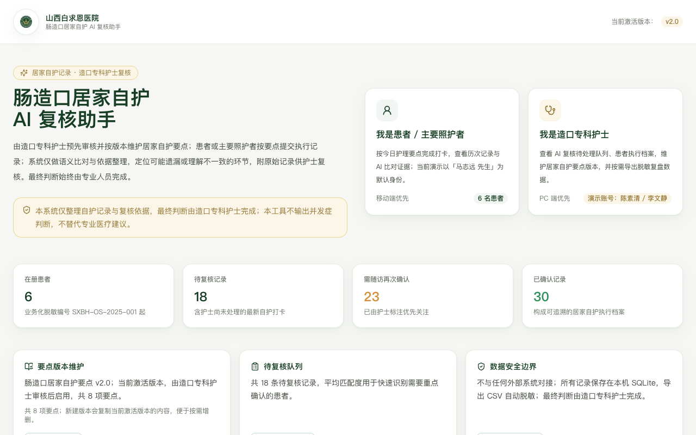

首页同时展示两个并列入口卡：上方为「我是患者 / 主要照护者」，默认进入移动端；下方为「我是造口专科护士」，进入管理后台。页面底部固定显示一条中性提示，提醒系统边界与最终判断的归属。点击任意入口即可进入对应端，全程无需登录。

## 三、患者端

### 1. 患者端首页

患者端首页以移动端宽度居中显示，顶部为院徽与当前患者身份卡，中部展示今日待办与最近一次自护记录，下方提示当前激活的护理要点版本与温馨提示。页面顶部可切换演示患者。

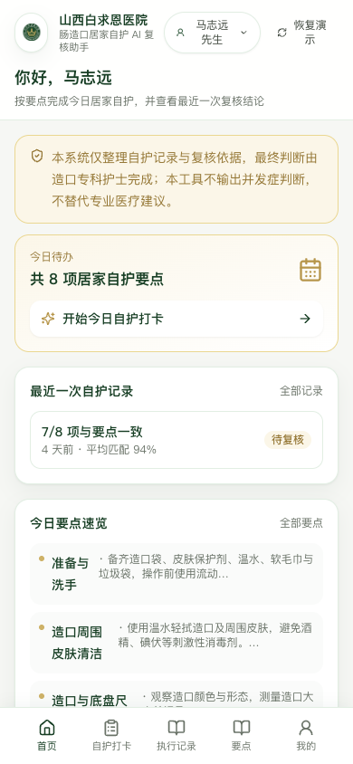

### 2. 自护打卡向导

自护打卡向导按 8 项要点依次展开，每步显示该要点的完整描述，并提供「已按要点执行 / 部分执行 / 暂未执行 / 不适用」四个执行选项以及一段自由描述区。患者可针对每一步补充自己的原话，AI 将以此为比对依据。

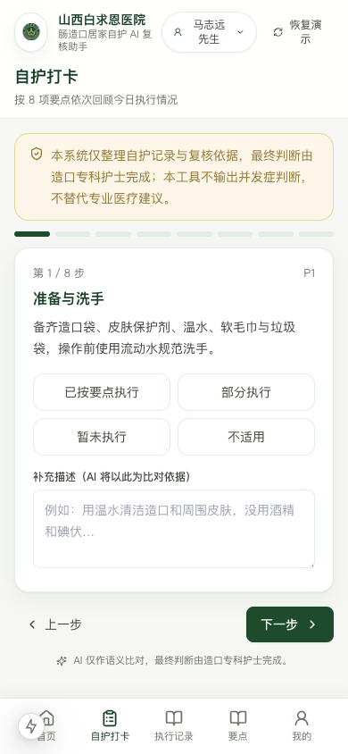

向导末步会显示记录人、补充说明与提交按钮，提交后立即进入 AI 复核。

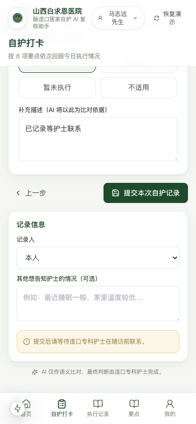

### 3. 提交完成

提交后系统立即给出 AI 复核结果摘要，列出每项要点的匹配百分比与状态（与要点一致 / 表达模糊需再次确认 / 未明确提及 / 依据不足），并提示等待造口专科护士在随访前完成最终确认。

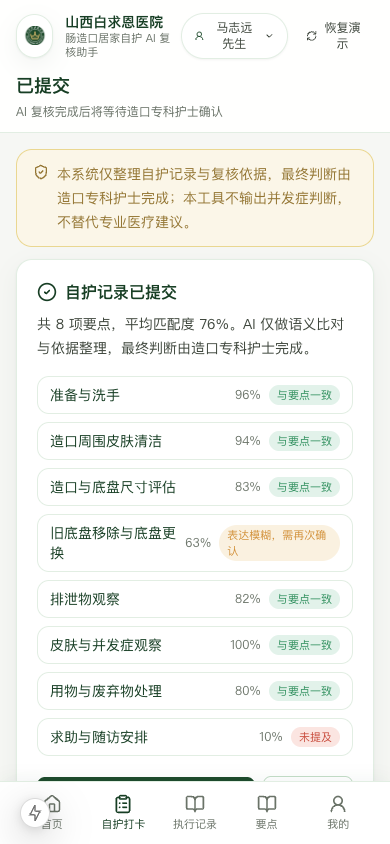

### 4. 执行记录列表

执行记录页以时间倒序展示全部自护记录，每条记录显示匹配百分比、需再次确认的项数以及当前整体状态徽标。点击任一记录可进入详情查看 AI 命中的关键词与护士复核备注。

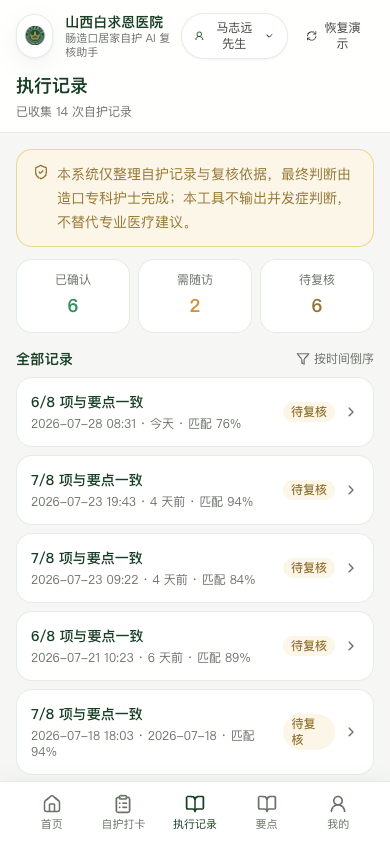

### 5. 记录详情

记录详情页逐项展示 AI 比对结论，包括原话引用、命中的关键词、护士复核备注与复核人。

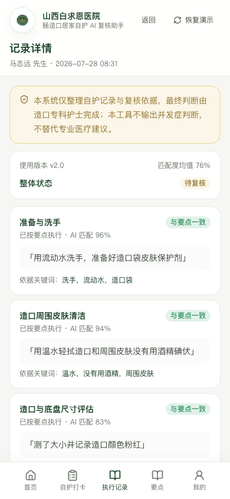

### 6. 居家自护要点

居家自护要点页展示当前激活版本的 8 项要点，并允许浏览历史版本对照变更。

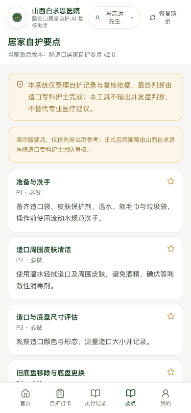

### 7. 个人中心

个人中心展示脱敏后的患者信息，包括编号、性别、年龄段、造口类型、手术时间、主要照护者、责任护士与当前激活版本号。

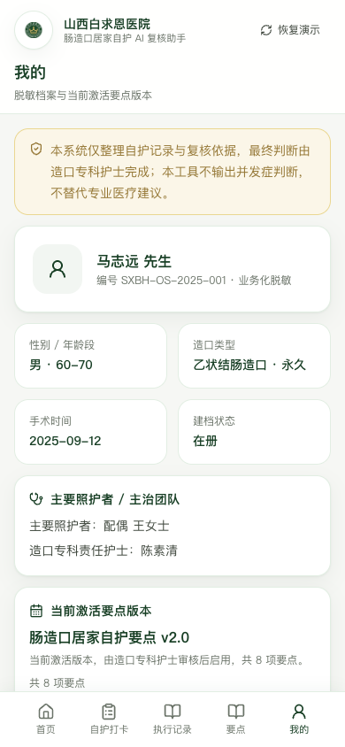

## 四、护士管理端

### 1. 工作台

工作台在屏幕上方展示 4 张关键指标卡，分别为待复核记录、本周新增、平均匹配度、需重点确认患者数；中部是「AI 复核待处理队列」与「今日关注患者」面板；下方显示匹配度趋势、记录状态分布与演示账号。

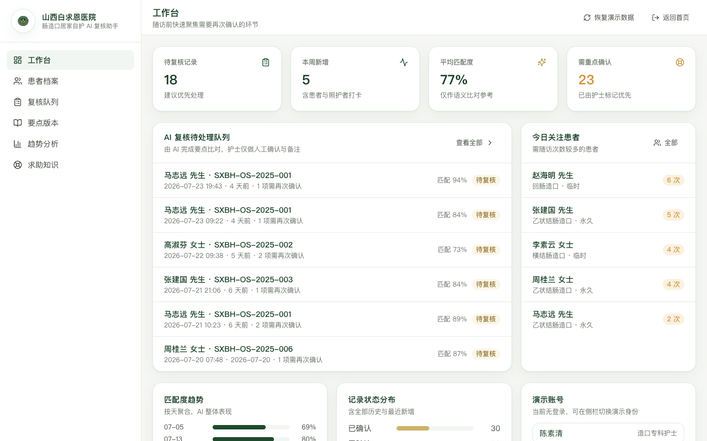

### 2. 患者档案

患者档案页以表格形式列出所有在册患者，提供编号、脱敏姓名、年龄段、造口类型、责任护士、最近记录、AI 结论状态、档案状态等列；点击「详情」可进入档案详情。

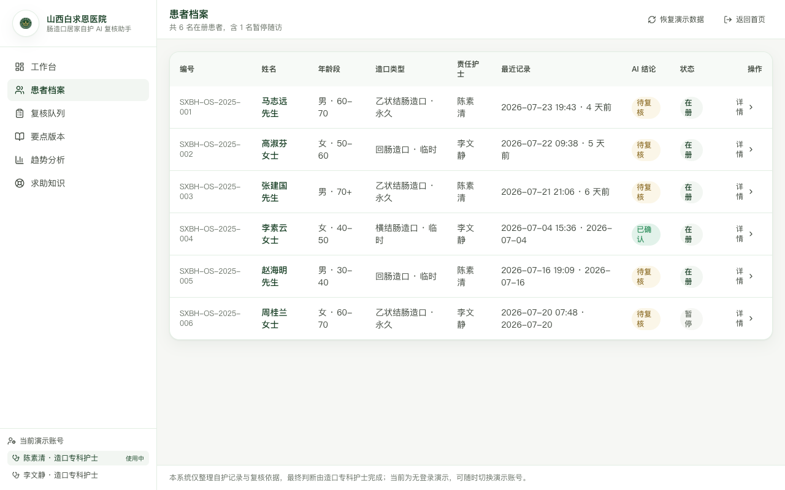

### 3. 患者档案详情

档案详情页左列展示基本信息、8 项要点近期执行进度与执行记录时间轴；右列展示当前选中的自护记录逐项 AI 比对结果与护士三态复核按钮（已确认 / 需随访再次确认 / 暂不适用）。

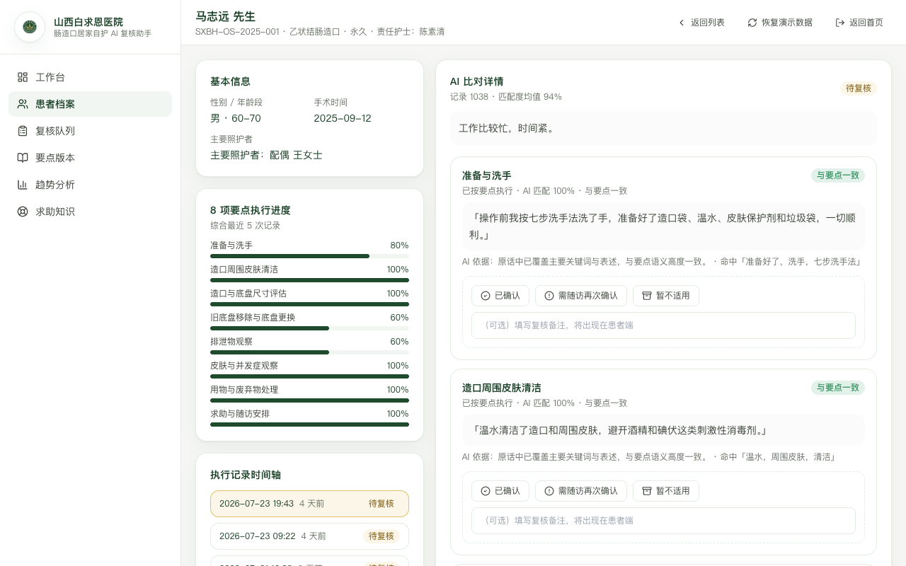

### 4. 复核队列

复核队列页按状态筛选全部自护记录，并提供「去复核」入口，便于在随访前批量处理待办。

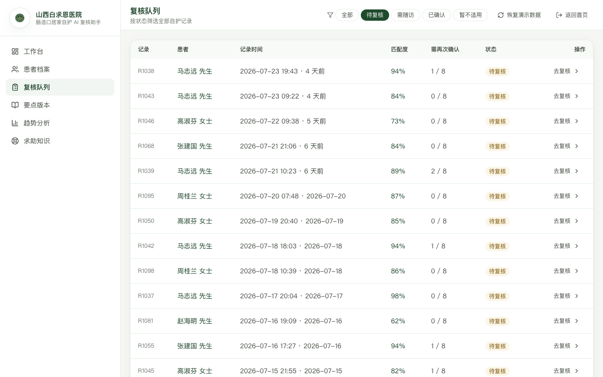

### 5. 居家自护要点版本

要点版本页左侧展示所有版本的元信息（版本号、状态、要点数、生效时间、复核人），右侧展示当前选中版本的所有要点；可通过顶部「新建版本」按钮基于当前激活版本复制并修改，便于医院在实际启用前持续打磨。

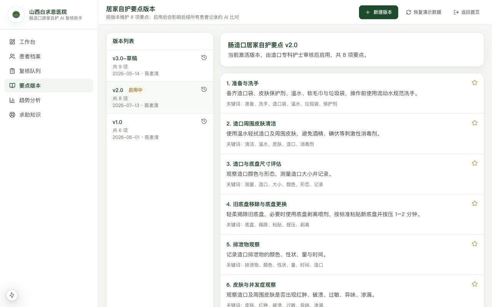

### 6. 新建版本弹窗

新建版本时只需填写版本号、标题与说明，系统会自动复制当前激活版本的所有要点，护士可在编辑后切换为启用版本。

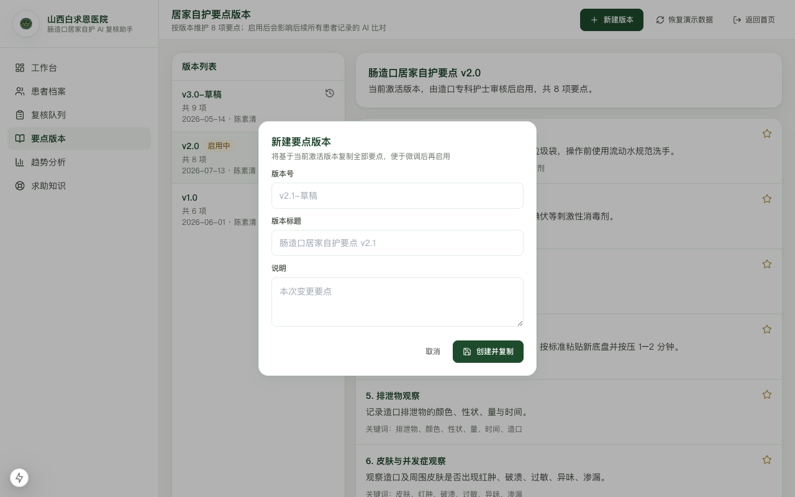

### 7. 趋势分析

趋势分析页支持切换 7/30/90 天窗口，展示 AI 匹配度趋势、记录数与匹配度的双轴图、记录状态环形分布以及需重点确认患者排行，并提供「导出脱敏 CSV」按钮，导出文件自动落盘到本机并包含 BOM，Excel 可直接打开。

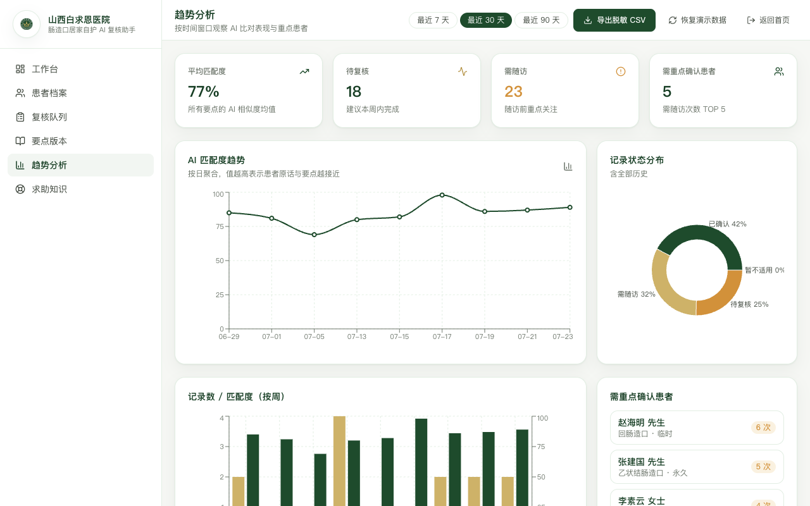

### 8. 求助与知识条目

求助与知识条目页按主题整理护士在电话与微信随访中可参考的常见问题与回应参考，覆盖造口周围皮肤、底盘选择、异味与渗漏、社交与心理、饮食与作息、随访与求助六大类，便于护士在随访前快速查阅。

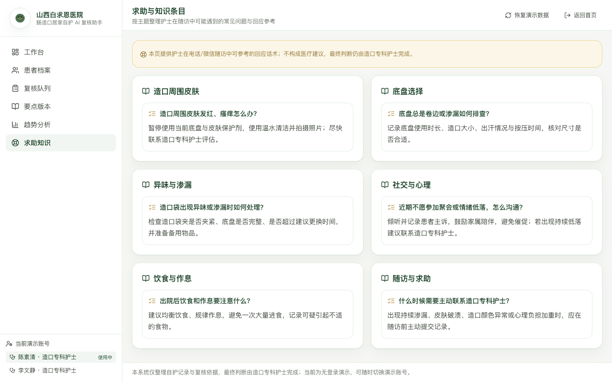

## 五、业务流程

患者或主要照护者通过患者端提交自护记录，系统立即按当前激活版本做语义比对并写入数据库；护士在管理端工作台看到新记录后进入详情页，对每条要点结论选择「已确认」「需随访再次确认」或「暂不适用」，所有动作落入审计日志；随访结束后可通过趋势分析页观察连续情况，必要时一键导出脱敏 CSV 复盘。整个流程不与任何外部系统对接。

## 六、数据说明

系统内置 6 名业务化脱敏患者、3 个要点版本、约 70 条自护记录与 500 余条记录项，覆盖不同依从性、不同年龄段与不同造口类型。所有数据由本机数据库保存，重启服务后仍然保留；如需恢复初始状态，可点击任意端右上角的「恢复演示数据」按钮。CSV 导出文件自动落盘到本机 `data/exports/` 目录，并在响应头中返回带 BOM 的 UTF-8 内容，Excel 可直接打开并保留中文。

## 七、常见问题

护士如发现某条记录的 AI 结论明显不符合现场情况，可在档案详情页直接修改该要点的复核状态，并补充备注。版本变更不会影响历史记录，因为每条记录都带有所使用的版本号，便于事后追溯与对照。如果某位患者的近期匹配度持续偏低，可结合求助知识页的常见问题与档案详情中的执行进度条进行针对性指导。
